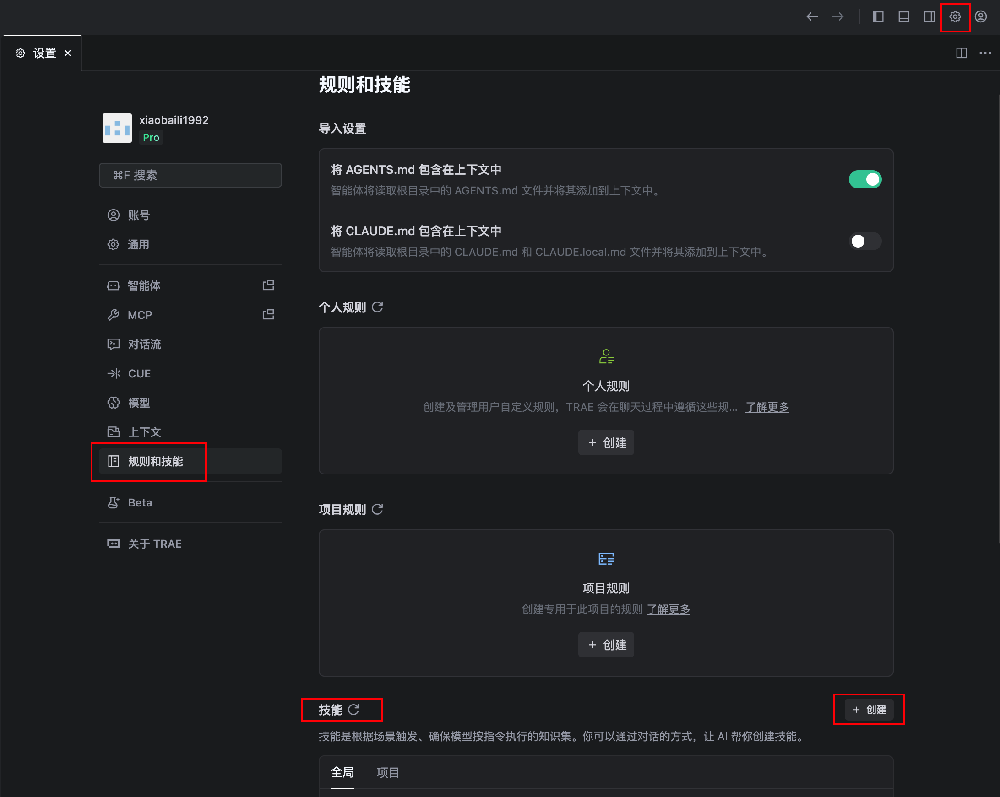
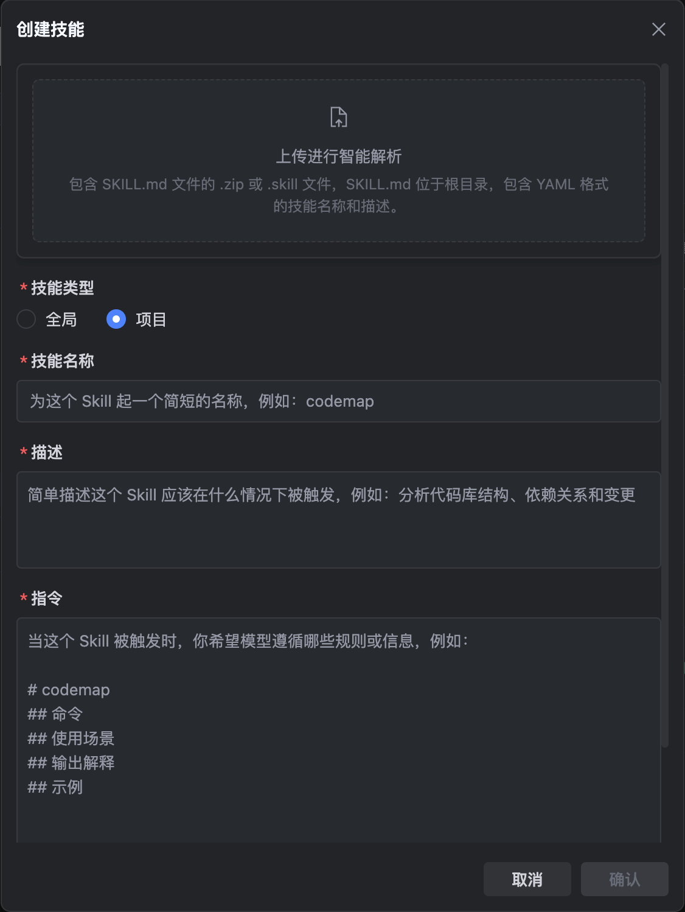
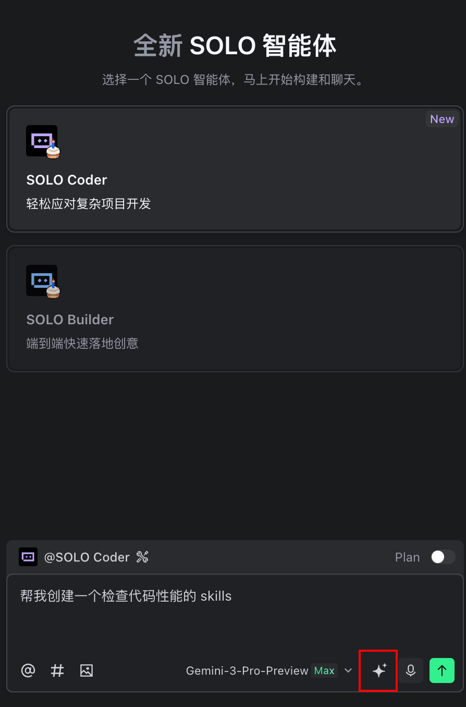

>Trae 是一款强大的 AI 编程助手，与 Cursor 类似，能够帮助开发者更高效地编写代码。而 **Skills（技能）** 则是 Trae 的核心扩展机制，可以让 AI 具备更多定制化的能力。本文将详细介绍什么是 Skills，为什么需要使用 Skills，以及四种不同的安装方法，帮助你快速上手并提升开发效率。

---
## 📑 目录
- [什么是Skills](#什么是skills)
- [为什么使用 Skills](#为什么使用-skills)
- [如何在项目中安装 Skills](#如何在项目中安装-skills)
  - [方法一：使用 skills 命令安装](#方法一使用-skills-命令安装)
  - [方法二：使用 openskills 命令安装](#方法二使用-openskills-命令安装)
  - [方法三：手动安装（界面操作）](#方法三手动安装界面操作)
  - [方法四：使用 SOLO Coder 模式让 AI 创建 Skills](#方法四使用-solo-coder-模式让-ai-创建-skills)
- [💡 最佳实践建议](#-最佳实践建议)
- [📝 总结](#-总结)

---
## 什么是Skills
Skills简单来说，就是赋予 AI 助手（如 Trae、Cursor 或 Vercel 的 AI SDK）的特定“能力包”或“工具箱”。
如果把 AI 比作一个刚入职的超级实习生，它有很强的通用智力和基础知识，但它可能不懂你们公司的具体代码规范、不懂怎么部署到特定的服务器、
也不知道你们常用的某个特定库的用法。
这时候，Skills 就像是给这个实习生发放的《岗位操作手册》或《专项技能培训》。
## 为什么使用 Skills
### 🎯 扩展 AI 能力边界
Trae 默认功能已经很强大，但通过安装 Skills，你可以让 AI 掌握特定领域的专业知识，比如：
- 🔍 代码性能分析
- 🧪 单元测试生成
- 📝 文档自动生成
- 🔄 代码重构建议
### ⚡ 提升开发效率
Skills 就像是给 AI 配备了"工具包"，让它在处理特定任务时更加游刃有余：
- 减少重复性工作
- 提供更精准的代码建议
- 自动化复杂流程
### 🌐 社区资源共享
通过 Skills 生态，你可以：
- 使用社区验证过的优质技能
- 分享自己创建的技能
- 学习他人的最佳实践
### 🛠️ 高度可定制化
每个项目和团队都有独特的需求，Skills 让你能够：
- 创建符合项目规范的代码生成模板
- 集成团队常用的工具和脚本
- 定义特定的代码审查规则
---
## 如何在全局或项目中安装 Skills
Trae 提供了多种安装 Skills 的方式，你可以根据实际情况选择最适合的一种。

---
### 方法一：使用 skills 命令安装
这是最直接、最常用的安装方式，适合快速安装社区共享的 Skills。
#### 🔹 通过 GitHub 仓库安装
```bash
# 使用完整仓库路径
npx skills add vercel-labs/agent-skills
# 或者使用完整的 GitHub URL
npx skills add https://github.com/vercel-labs/agent-skills
# 也可以直接将skills安装在全局，然后通过skills来安装
npm i skills -g
skills add vercel-labs/agent-skills
# or
skills add https://github.com/vercel-labs/agent-skills
```
**示例说明：**
- `vercel-labs/agent-skills` 是 Vercel 实验室开发的官方技能包
- 安装后，Trae 将获得 Agent 相关的增强能力
#### 🔹 查看已安装的 Skills
```bash
# 列出当前项目中所有已安装的 Skills
npx skills list
```
#### 🔹 其他常用命令
```bash
# 查找可用的 Skills
npx skills find [query]
# 将所有已安装的skills更新到最新版本
npx skills update
# 检查是否有可用的skills更新
npx skills check
# 删除指定的 Skill
npx skills remove [skills]
```
#### 文档地址
```
https://github.com/vercel-labs/skills
```

#### ✅ 适用场景
- 需要快速安装开源社区维护的 Skills
- 项目使用公共仓库管理配置
- 团队协作需要统一的技能集
#### 💡 小贴士
> 安装前可以先访问 GitHub 仓库查看 Skill 的文档和使用说明，确保它符合你的需求。
---
### 方法二：使用 openskills 命令安装
`openskills` 是一个专门用于管理 Skills 的工具，提供了更丰富的功能和更好的用户体验。
#### 🔹 安装指定组织的 Skills
```bash
# 安装 Anthropic 官方提供的 Skills
npx openskills install anthropics/skills
# 安装GitHub Repo
npx openskills install your-org/your-skills
# 安装本地目录中的 Skill
npx openskills install ./local-skills/my-skill
# 也可以直接将openskills安装在全局，然后通过openskills来安装
npm i openskills -g
openskills install vercel-labs/agent-skills
# or
openskills install your-org/your-skills
# or
openskills install ./local-skills/my-skill
```
#### 🔹 同步最新的 Skills
```bash
# 同步远程仓库的最新更新
npx openskills sync
```
#### 🔹 查看已安装的 Skills
```bash
# 列出当前项目中所有已安装的 Skills
npx openskills list
```

#### 🔹 其他常用命令
```bash
# 更新 Skills
npx openskills update [name...]
# 查看某个 Skill 的详细信息
npx openskills read <name>
# 删除指定的 Skill
npx openskills remove <name>
```
#### 文档地址
```
https://github.com/numman-ali/openskills
```

---
### 方法三：手动安装（界面操作）
如果你更倾向于可视化操作，或者需要创建自定义的 Skills，手动安装是最好的选择。
#### 🔹 详细操作步骤
1. **打开设置面板**
   - 点击 Trae 界面右上角的 ⚙️ **设置按钮**
2. **进入规则和技能配置**
   - 在设置菜单中选择「规则和技能」选项
3. **创建新技能**
   - 找到技能栏，点击「创建」按钮
   - 输入技能名称和描述
   - 选择是全局安装还是项目安装
4. **添加技能内容**
   
   **方式 A：上传文件**
   ```
   点击 上传进行智能解析 
   → 选择本地的 包含SKILL.md文件的.zip或.skill文件，SKILL.md位于根目录，包含YAML格式的技能名称和描述
   → 确认
   ```
   **方式 B：直接输入**
   - 在文本编辑器中直接编写技能配置
   - 支持语法高亮和实时验证



---

### 方法四：使用 SOLO Coder 模式让 AI 创建 Skills
这是最智能、最便捷的方式，让 AI 帮助你生成需要的技能配置。
#### 🔹 启用 SOLO Coder 模式
在 Trae 中切换到 **SOLO Coder** 模式，这个模式专门用于与 AI 进行深度交互。
#### 🔹 向 AI 提出需求
```
帮我创建一个检查代码性能的 skills
```
#### 🔹 让 AI 优化提示词（推荐）
如果希望获得更精准的结果，可以先让 AI 帮你优化提示词，点击输入框右边的 两个四角星图标：

**AI 返回优化后的提示词：**
```
开发一个专门用于检查和分析代码性能的skills功能模块。该模块需要能够自动检测代码执行时间、内存使用情况、CPU占用率等关键性能指标，支持多种编程语言（如JavaScript、Python、Java等），提供详细的性能报告和可视化图表，包含性能瓶颈识别、优化建议生成、历史性能数据对比等功能。要求实现实时监控、批量分析、自定义性能阈值设置，输出格式需支持JSON、HTML报告和图表展示，确保分析结果准确可靠，响应时间在毫秒级别，并支持集成到现有开发环境中。
```

#### 🔹 安装生成的技能
AI 生成配置后，Trae 会自动提示你安装到全局还是项目中，你可以根据实际情况选择，点击「确认」即可完成安装。
#### ✅ 适用场景
- 不熟悉技能配置的语法和结构
- 需要快速创建特定功能的技能
- 希望借助 AI 的经验生成最佳实践配置
#### 💡 进阶技巧
> 你可以让 AI 帮你创建技能的测试用例，确保技能配置的正确性：
```
为上面创建的性能分析技能生成一些测试用例，
验证它能否正确识别各种性能问题
```

## 好的Skills推荐
```
https://github.com/anthropics/skills
https://github.com/vercel-labs/agent-skills
https://github.com/ComposioHQ/awesome-claude-skills
```
---
## 📝 总结
本文详细介绍了在 Trae 中安装 Skills 的四种方法：
| 方法 | 优点 | 缺点 | 推荐场景 |
|------|------|------|----------|
| **skills 命令** | 简单快捷 | 功能相对基础 | 快速安装开源技能 |
| **openskills 命令** | 功能丰富，支持版本管理 | 需要额外学习命令 | 复杂项目和长期维护 |
| **手动安装** | 可视化操作，灵活度高 | 操作步骤较多 | 自定义技能创建 |
| **SOLO Coder 模式** | 智能生成，降低门槛 | 依赖 AI 理解能力 | 快速创建特定技能 |

选择哪种方式取决于你的具体需求和技术偏好。对于新手，建议从 **skills 命令**开始；对于需要深度定制的团队，推荐使用 **openskills 命令**配合 **手动安装**；而 **SOLO Coder 模式**则适合快速生成特定功能的技能配置。
Skills 是 Trae 强大的扩展机制，善用它将极大地提升你的开发效率。开始尝试安装你的第一个 Skill 吧！🎉

---
希望这篇教程对你有所帮助！如有问题，欢迎交流讨论。
