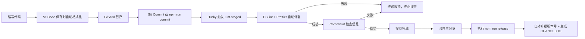

> 前端规范不是束缚，而是团队协作的“交通规则”。本文将从零开始，带你一步步搭建一套包含代码质量、样式检查、提交规范、自动化发版和编辑器配置的**完整前端工程化体系**。
---
## 📋 目录
- [前言：为什么需要这套体系？](#前言为什么需要这套体系)
- [第一阶段：代码质量与风格](#第一阶段代码质量与风格)
- [第二阶段：样式规范](#第二阶段样式规范)
- [第三阶段：自动化拦截](#第三阶段自动化拦截)
- [第四阶段：提交信息规范化](#第四阶段提交信息规范化)
- [第五阶段：自动化发版（进阶）](#第五阶段自动化发版进阶)
- [第六阶段：编辑器配置（最后一块拼图）](#第六阶段编辑器配置最后一块拼图)
- [总结](#总结)
---
## 前言：为什么需要这套体系？
一个规范的前端项目应该像一个自动化工厂：
- 🔍 **有人质检**：代码写错了？编译器告诉你。
- 🎨 **有人美容**：代码格式乱了？保存时自动修好。
- 🚧 **有人安检**：想提交 Bug 代码？Git Hook 拦截你。
- 📝 **有人记录**：版本更新了？自动生成更新日志。
我们将使用以下**增强版**工具链来实现这一切：
| 工具 | 作用 | 推荐理由 |
| :--- | :--- | :--- |
| **ESLint + Prettier** | JS/TS 语法与格式 | 业界标准，生态最丰富 |
| **Stylelint** | CSS/SCSS 样式检查 | **(新增)** 防止 CSS 冗余和错误 |
| **Husky + lint-staged** | Git 钩子与暂存检查 | 只检查修改的文件，速度快 |
| **Commitizen + cz-git** | 交互式提交 | 中文友好，提示清晰 |
| **Commitlint** | 提交信息校验 | 强制规范，防止乱写 |
| **standard-version** | 自动发版与日志 | **(新增)** 根据 commit 自动生成 CHANGELOG |
| **EditorConfig** | 跨编辑器配置 | 统一不同编辑器的缩进风格 |
---
## 第一阶段：代码质量与风格
### 1. 初始化项目
首先，确保你有一个基础的 Vite + React + TypeScript 项目。
```bash
npm create vite@latest my-super-project -- --template react-ts
cd my-super-project
```
### 2. 安装 ESLint 与 Prettier
我们需要安装核心库以及解决它们之间冲突的配置包。
```bash
# 安装 ESLint 及相关插件 项目初始化已经安装，如果没安装，执行下面命令
npm install -D eslint eslint @eslint/js typescript-eslint eslint-plugin-react-hooks eslint-plugin-react-refresh

# 安装 Prettier 及解决冲突的包
npm install -D prettier eslint-config-prettier eslint-plugin-prettier
```
### 3. 配置 Prettier
在项目根目录创建 `.prettierrc`：
```javascript:.prettierrc
{
  "printWidth": 100,
  "tabWidth": 2,
  "useTabs": false,
  "semi": true,
  "singleQuote": true,
  "quoteProps": "as-needed",
  "jsxSingleQuote": true,
  "trailingComma": "all",
  "bracketSpacing": true,
  "jsxBracketSameLine": true,
  "arrowParens": "always",
  "requirePragma": false,
  "insertPragma": false,
  "proseWrap": "preserve",
  "htmlWhitespaceSensitivity": "ignore",
  "vueIndentScriptAndStyle": false,
  "endOfLine": "lf",
  "embeddedLanguageFormatting": "auto",
  "parserOptions": {
    "ecmaVersion": 2020
  }
}
```
在根目录创建 `.prettierignore`：
```text:.prettierignore
dist
node_modules
public
.husky
.vscode
.idea
coverage
*.lock
package-lock.json
*.sh
*.md

src/assets
```
### 4. 配置 ESLint
在根目录创建 `eslint.config.js`（项目初始化已创建了该文件，内容或有差异，如果没有，则创建该文件，内容如下）：
```javascript:eslint.config.js
import js from '@eslint/js';
import globals from 'globals';
import reactHooks from 'eslint-plugin-react-hooks';
import reactRefresh from 'eslint-plugin-react-refresh';
import prettierPlugin from 'eslint-plugin-prettier';
import prettier from 'eslint-config-prettier';
import tseslint from 'typescript-eslint';
import { defineConfig, globalIgnores } from 'eslint/config';

export default defineConfig([
  globalIgnores(['dist']),
  {
    files: ['**/*.{ts,tsx}'],
    extends: [
      js.configs.recommended,
      tseslint.configs.recommended,
      reactHooks.configs.flat.recommended,
      reactRefresh.configs.vite,
      prettier,
    ],
    plugins: {
      prettier: prettierPlugin,
    },
    rules: {
      'prettier/prettier': 'error',
    },
    languageOptions: {
      ecmaVersion: 2020,
      globals: globals.browser,
    },
  },
]);
```
---
## 第二阶段：样式规范
很多项目忽略了 CSS 的规范化，导致 CSS 文件体积膨胀、难以维护。`stylelint` 是目前最流行的 CSS Linter。
### 1. 安装依赖
```bash
npm install -D stylelint stylelint-config-standard stylelint-config-recommended-scss
```
### 2. 配置 Stylelint
在根目录创建 `.stylelintrc`：
```javascript:.stylelintrc
{
  extends: [
    'stylelint-config-standard',
    'stylelint-config-recommended-scss',
  ],
  rules: {
    'at-rule-no-unknown': null,
    'scss/at-rule-no-unknown': true,
    'selector-class-pattern': null,
  },
}
```
---
## 第三阶段：自动化拦截
这是规范落地的核心：**利用 Git Hook 在代码提交前自动检查和修复。**
### 1. 安装依赖
```bash
npm install -D husky lint-staged
```
### 2. 初始化 Husky
```bash
npx husky init
```
这会生成 `.husky` 目录并修改 `package.json` 的 `prepare` 脚本。
### 3. 配置 lint-staged
在根目录创建 `.lintstagedrc`。我们需要针对不同类型的文件执行不同的检查命令。
```json:.lintstagedrc
{
  "*.{js,jsx,ts,tsx}": [
    "eslint --fix",
    "prettier --write"
  ],
  "*.{css,scss,less}": [
    "stylelint --fix",
    "prettier --write"
  ],
  "*.{json,md}": [
    "prettier --write"
  ]
}
```
### 4. 配置 Husky 钩子
将 `.husky/pre-commit` 文件内容修改为：
```bash:.husky/pre-commit
npx lint-staged
```
**效果**：当你执行 `git commit` 时，Husky 会触发 `lint-staged`，它会自动找到你本次修改的文件，运行 ESLint 自动修复，运行 Prettier 自动格式化。如果修复后仍有错误，则提交被拦截。

---
## 第四阶段：提交信息规范化
让 Git 历史变得清晰可读。
### 1. 安装依赖
```bash
npm install -D @commitlint/cli @commitlint/config-conventional commitizen cz-git
```
### 2. 配置 Commitlint
创建 `.commitlintrc`：
```javascript:.commitlintrc
extends:
  - '@commitlint/config-conventional'
rules: {}
prompt:
  alias:
    fd: 'docs: fix typos'
  messages:
    type: '选择你要提交的类型 :'
    scope: '选择一个提交范围（可选）:'
    customScope: '请输入自定义的提交范围 :'
    subject: "填写简短精炼的变更描述 :\n"
    body: "填写更加详细的变更描述（可选）。使用 \"|\" 换行 :\n"
    breaking: "列举非兼容性重大的变更（可选）。使用 \"|\" 换行 :\n"
    footerPrefixesSelect: '选择关联issue前缀（可选）:'
    customFooterPrefix: '输入自定义issue前缀 :'
    footer: "列举关联issue (可选) 例如: #31, #I3244 :\n"
    confirmCommit: '是否提交或修改commit ?'
  types:
    - value: 'feat'
      name: 'feat:     新增功能 | A new feature'
    - value: 'fix'
      name: 'fix:      修复缺陷 | A bug fix'
    - value: 'docs'
      name: 'docs:     文档更新 | Documentation only changes'
    - value: 'style'
      name: 'style:    代码格式 | Changes that do not affect the meaning of the code'
    - value: 'refactor'
      name: 'refactor: 代码重构 | A code change that neither fixes a bug nor adds a feature'
    - value: 'perf'
      name: 'perf:     性能提升 | A code change that improves performance'
    - value: 'test'
      name: 'test:     测试相关 | Adding missing tests or correcting existing tests'
    - value: 'build'
      name: 'build:    构建相关 | Changes that affect the build system or external dependencies'
    - value: 'ci'
      name: 'ci:       持续集成 | Changes to our CI configuration files and scripts'
    - value: 'revert'
      name: 'revert:   回退代码 | Revert to a commit'
    - value: 'chore'
      name: 'chore:    其他修改 | Other changes that do not modify src or test files'
  useEmoji: false
  emojiAlign: 'center'
  useAI: false
  aiNumber: 1
  themeColorCode: ''
  scopes: []
  allowCustomScopes: true
  allowEmptyScopes: true
  customScopesAlign: 'bottom'
  customScopesAlias: 'custom'
  emptyScopesAlias: 'empty'
  upperCaseSubject: false
  markBreakingChangeMode: false
  allowBreakingChanges:
    - 'feat'
    - 'fix'
  breaklineNumber: 100
  breaklineChar: '|'
  skipQuestions: []
  issuePrefixes:
    - value: 'link'
      name: 'link:     链接 ISSUES 进行中'
    - value: 'closed'
      name: 'closed:   标记 ISSUES 已完成'
  customIssuePrefixAlign: 'top'
  emptyIssuePrefixAlias: 'skip'
  customIssuePrefixAlias: 'custom'
  allowCustomIssuePrefix: true
  allowEmptyIssuePrefix: true
  confirmColorize: true
  maxHeaderLength: .inf
  maxSubjectLength: .inf
  minSubjectLength: 0
  scopeOverrides: null
  defaultBody: ''
  defaultIssues: ''
  defaultScope: ''
  defaultSubject: ''
```
### 3. 配置 Commitizen (cz-git)
修改 `package.json`，增加 `config` 字段：
```json:package.json
"config": {
  "commitizen": {
    "path": "node_modules/cz-git"
  }
}
```
并在 `scripts` 中添加：`"commit": "git-cz"`。
```
"commit": "git-cz"
```
### 4. 配置 Husky 钩子
创建或修改 `.husky/commit-msg`：
```bash:.husky/commit-msg
npx --no -- commitlint --edit $1
```
**效果**：
- 使用 `npm run commit` 进入交互式选择界面，自动生成规范的 Message。
- 如果强行使用 `git commit -m "xxx"`，且 xxx 不符合规范，Commitlint 会拦截提交。
---
## 第五阶段：自动化发版（进阶）
这是一个“惊艳”的操作。我们可以根据 Git 提交记录，自动升级版本号（v1.0.0 -> v1.0.1），并自动生成 `CHANGELOG.md`。
### 1. 安装 standard-version
```bash
npm install -D standard-version
```
### 2. 配置脚本
在 `package.json` 的 `scripts` 中添加：
```json:package.json
"scripts": {
  "release": "standard-version",
  "release:first": "standard-version --first-release",
  "release:patch": "standard-version --release-as patch",
  "release:minor": "standard-version --release-as minor",
  "release:major": "standard-version --release-as major"
}
```
### 3. 配置 Husky (可选)
如果你希望每次 push 到 main 分支自动发版，可以在 `.husky/pre-push` 中写入脚本，或者手动在 CI/CD 中配置。对于新手，建议**手动执行**。
### 4. 工作流
```bash
# 1. 开发代码，git add .
# 2. 使用 npm run commit 提交（例如 feat: 添加了新功能）
# 3. 合并到主分支后，执行：
npm run release
```
**执行后会发生什么？**
1. 读取 `package.json` 的版本号。
2. 根据 commit 信息（feat 还是 fix）升级版本号（patch 或 minor）。
3. 更新 `package.json` 和 `package-lock.json`。
4. 生成或更新 `CHANGELOG.md`（包含刚才的提交信息）。
5. 自动创建一个 git commit。
---
## 第六阶段：编辑器配置（最后一块拼图）
为了保证团队成员使用 VSCode 或 WebStorm 时缩进一致，我们需要配置文件。
### 1. 安装 EditorConfig 插件
在 VSCode 中搜索安装 `EditorConfig for VS Code`。
### 2. 创建 .editorconfig
在根目录创建 `.editorconfig`：
```ini:.editorconfig
root = true
[*]
charset = utf-8
indent_style = space
indent_size = 2
end_of_line = lf
insert_final_newline = true
trim_trailing_whitespace = true
[*.md]
trim_trailing_whitespace = false
```
### 3. 创建 .vscode/settings.json (VSCode 专用)
在项目根目录创建 `.vscode/settings.json`，当别人用 VSCode 打开此项目时，自动应用设置：
```json:.vscode/settings.json
{
  "editor.fontSize": 12,
  "editor.tabSize": 2,
  "eslint.enable": true,
  "editor.formatOnSave": true,
  "editor.formatOnType": true,
  "eslint.validate": [
    "vue",
    "html",
    "javascript",
    "typescript",
    "javascriptreact",
    "typescriptreact"
  ],
  "editor.defaultFormatter": "esbenp.prettier-vscode",
  "prettier.requireConfig": true,
  "prettier.semi": false,
  "editor.codeActionsOnSave": {
    "source.fixAll": "explicit",
    "source.fixAll.eslint": "explicit",
    "source.fixAll.stylelint": "explicit"
  },
  "javascript.format.insertSpaceBeforeFunctionParenthesis": false,
  "search.exclude": {
    "**/node_modules": true,
    "**/bower_components": true,
    "**/target": true,
    "**/logs": true
  },
  "css.validate": false,
  "less.validate": false,
  "scss.validate": false,
  "stylelint.validate": [
    "css",
    "less",
    "postcss",
    "scss",
    "sass",
    "stylus",
    "vue"
  ],
  "git.autofetch": true,
  "cSpell.userWords": [
    "antd",
    "axios",
    "childs",
    "commitlint",
    "daterange",
    "echarts",
    "graphlib",
    "loadfj",
    "moveend",
    "tailwindcss",
    "vuepress",
    "vuex",
  ],
  "workbench.startupEditor": "none",
  "diffEditor.ignoreTrimWhitespace": false,
  "workbench.iconTheme": "material-icon-theme"
}
```
在项目根目录创建 `.gitignore` 文件，添加以下内容：
```text:.gitignore
# Logs
logs
*.log
npm-debug.log*
yarn-debug.log*
yarn-error.log*
pnpm-debug.log*
lerna-debug.log*

node_modules
dist
dist-ssr
*.local

# Editor directories and files
.idea
.DS_Store
*.suo
*.ntvs*
*.njsproj
*.sln
*.sw?

```
> 💡 **注意**：
不要添加.vscode目录，不然setting.json内容没办法提交至git；
你需要安装 VSCode 插件 `Prettier` `ESLint` 和 `Stylelint`。
---
## 🎉 总结
至此，你的前端项目已经拥有了**装甲车级别的防护**。
### 完整的文件清单
检查你的项目根目录，现在应该包含以下配置文件：
```text
my-super-project/
├── .husky/                    # Git Hooks 目录
│   ├── pre-commit             # 提交前检查
│   └── commit-msg             # 提交信息检查
├── .vscode/                   # VSCode 项目配置
│   └── settings.json
├── .commitlintrc              # 提交信息检查
├── .editorconfig              # 统一编辑器风格
├── .gitignore                 # git提交忽略文件
├── .lintstagedrc              # 暂存文件检查配置
├── .prettierignore            # 代码格式化忽略文件
├── .prettierrc                # 代码格式化规则
├── .stylelintrc               # CSS 样式检查
├── CHANGELOG.md               # 自动生成的更新日志（运行 release 后）
├── eslint.config.js           # JS/TS 代码检查
├── package-lock.json          # JS/TS 代码检查
└── package.json               # 增加了各种脚本
```
### 核心工作流图解

### 💡 给新手的最后建议
1.  **不要一次全配**：先配好 ESLint 和 Prettier，习惯后再加 Husky，最后再加 Commitlint。
2.  **遇到冲突**：如果 ESLint 和 Prettier 报错打架，请确保安装了 `eslint-config-prettier` 并放在 `extends` 的最后。
3.  **享受过程**：看着代码自动排版，提交记录整整齐齐，这是一种极好的编程体验。
---

希望这篇教程对你有所帮助！如有问题，欢迎交流讨论。
