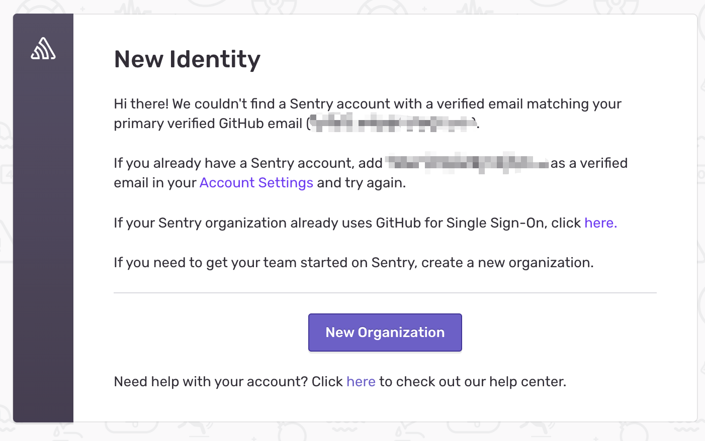
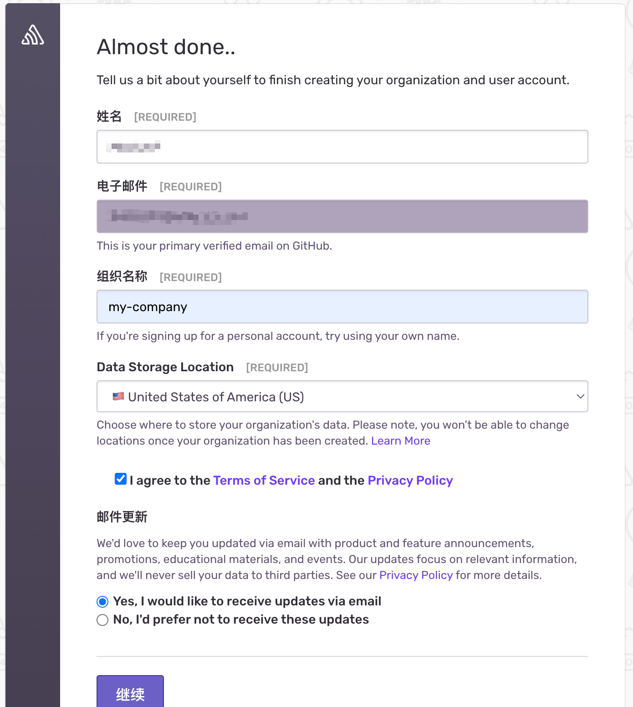
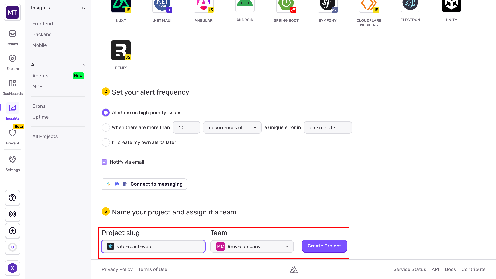
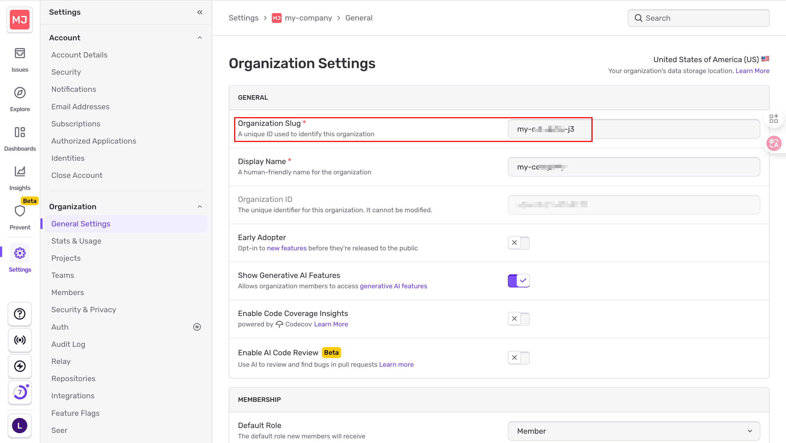
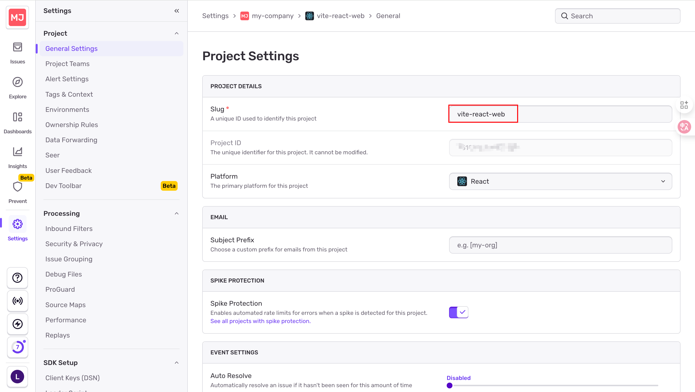
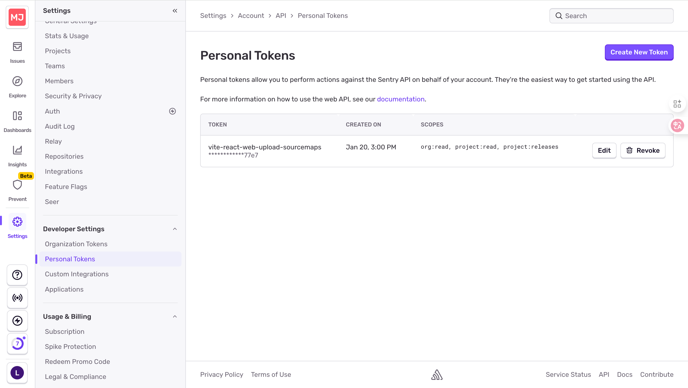
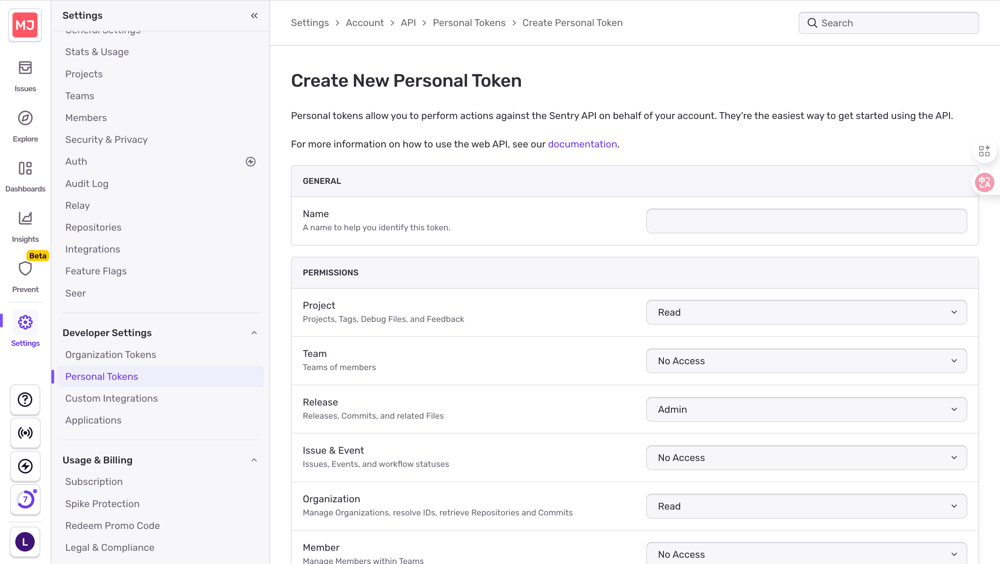
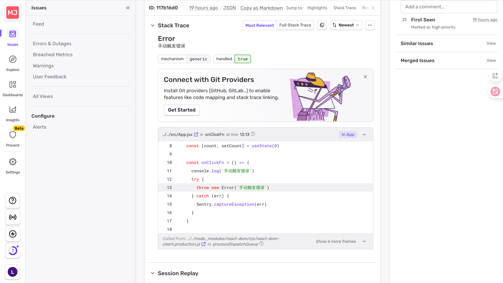
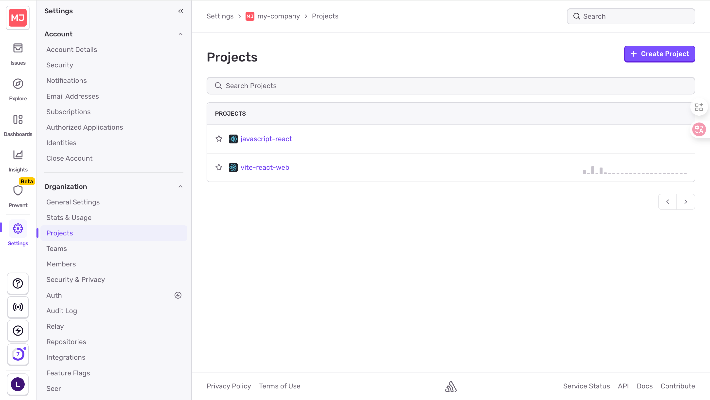
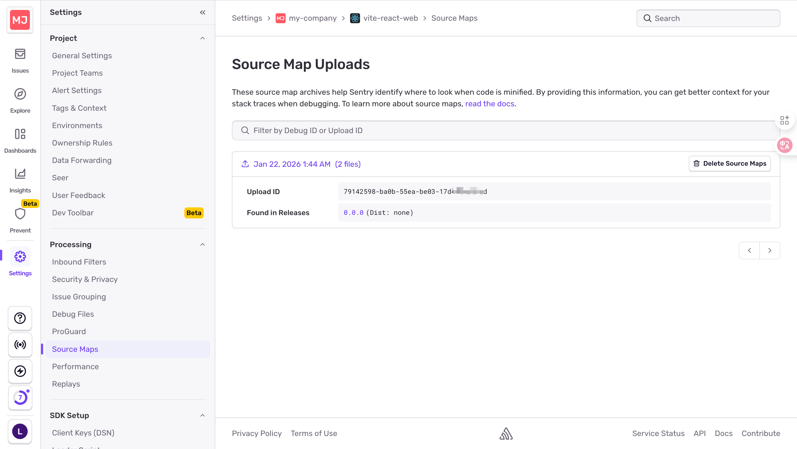

# 在 Vite + React 项目中集成 Sentry 完整指南
> 📚 本教程将带你从零开始，一步步完成 Sentry 在 Vite + React 项目中的接入与配置，实现错误监控与源码映射功能。
---
## 📋 目录
- [准备工作](#一准备工作)
- [创建 Sentry 项目](#二创建-sentry-项目)
- [初始化本地项目](#三初始化本地项目)
- [安装 Sentry 依赖](#四安装-sentry-依赖)
- [配置 Sentry](#五配置-sentry)
- [配置 Vite 插件](#六配置-vite-插件)
- [测试错误上报](#七测试错误上报)
- [设置 Auth Token](#八设置-auth-token)
- [构建与验证](#九构建与验证)
- [查看错误日志](#十查看错误日志)
---
## 一、准备工作
在开始之前，请确保你已经：
- ✅ 安装了 [Node.js](https://nodejs.org/)（建议 v18+）
- ✅ 安装了 [npm](https://www.npmjs.com/) 或 [yarn](https://yarnpkg.com/)
- ✅ 有基本的 React 和 Vite 开发经验
---
## 二、创建 Sentry 项目
### 1. 登录 Sentry 官网
👉 [https://sentry.io/](https://sentry.io/)
### 2. 创建 Organization
在 Sentry 控制台中创建一个新的组织：
| 配置项 | 说明 |
|--------|------|
| **Name** | 组织名称，自定义（如：`my-company`）|
| **Plan** | 选择 `Free` 版本即可，完全够用 |



### 3. 创建 Project
在组织中创建一个新项目：
| 配置项 | 说明 |
|--------|------|
| **Platform** | 选择 `React` |
| **Project name** | 填写项目名称（如：`vite-react-app`）|
> ⚠️ **重要提示**：创建完成后，请复制并保存好以下 **DSN** 地址，后续配置会用到：
```
https://4352b88f3321d7e98766b0b743fa7115@o4514356086109909.ingest.us.sentry.io/4510743223411211
```




---
## 三、初始化本地项目
使用 Vite 创建一个新的 React 项目：
```bash
npm create vite@latest my-react-app -- --template react
```
---
## 四、安装 Sentry 依赖
在项目根目录执行以下命令安装 Sentry 相关包：
```bash
npm install @sentry/react @sentry/vite-plugin
```
| 包名 | 说明 |
|------|------|
| `@sentry/react` | 浏览器错误捕获 + React Error Boundary |
| `@sentry/vite-plugin` | Source Map 上传插件（关键组件）|
---
## 五、配置 Sentry
### 1. 创建 Sentry 初始化文件
在 `src` 目录下新建 `sentry.ts` 文件：
```typescript:src/sentry.ts

import * as Sentry from "@sentry/react";
export function initSentry() {
  // 本地开发环境不自动上报，避免污染
  if (import.meta.env.DEV) {
    return;
  }
  Sentry.init({
    dsn: import.meta.env.VITE_SENTRY_DSN,
    integrations: [
      Sentry.browserTracingIntegration(),
    ],
    // 性能追踪采样率，生产环境建议 0.1 ～ 0.3
    tracesSampleRate: 1.0,
    
    // 设置环境标识
    environment: import.meta.env.MODE,
    // 在发送前可对事件进行脱敏处理
    beforeSend(event) {
      return event;
    },
  });
}
```
### 2. 在入口文件中初始化 Sentry
修改 `main.tsx`，**注意：必须在 React 渲染之前初始化 Sentry**
```typescript:src/main.tsx

import React from "react";
import ReactDOM from "react-dom/client";
import App from "./App";
import { initSentry } from "./sentry";
// 初始化 Sentry（必须在渲染前调用）
initSentry();
ReactDOM.createRoot(document.getElementById("root")!).render(
  <React.StrictMode>
    <App />
  </React.StrictMode>,
);
```
### 3. 配置环境变量
在项目根目录新建 `.env.production` 文件：
```env:.env.production

SENTRY_ORG=my-company-j3
SENTRY_PROJECT=vite-react-web
VITE_SENTRY_DSN=https://4352b88f3321d7e98766b0b743fa7115@o4514356086109909.ingest.us.sentry.io/4510743223411211
SENTRY_AUTH_TOKEN=<从Sentry控制台获取>
SENTRY_RELEASE=my-react-app@0.0.0
```
#### 环境变量说明
| 变量名 | 说明 | 获取方式 | 截图 |
|--------|------|----------|------|
| `SENTRY_ORG` | 组织标识 | `Settings` → `Organization` → `General Settings` |  |
| `SENTRY_PROJECT` | 项目标识 | `Settings` → `Organization` → `Projects` → `<项目名称>` → `Project` → `Slug` |  |
| `VITE_SENTRY_DSN` | 数据源名称 | 创建项目时显示的 DSN |  |
| `SENTRY_AUTH_TOKEN` | 认证令牌 | 见下文「[设置 Auth Token](#设置-auth-token)」 |  |
| `SENTRY_RELEASE` | 发布版本号 | 根据实际项目填写（如：`my-react-app@1.0.0`）|
---
## 六、配置 Vite 插件
修改 `vite.config.ts`，配置 Sentry 插件以实现 Source Map 上传：
```typescript:vite.config.ts

import { defineConfig, loadEnv } from 'vite'
import react from '@vitejs/plugin-react'
import { sentryVitePlugin } from '@sentry/vite-plugin'
export default defineConfig(({ mode }) => {
  const env = loadEnv(mode, process.cwd(), '')
  return {
    build: {
      sourcemap: true,
    },
    define: {
      'import.meta.env.VITE_SENTRY_RELEASE': JSON.stringify(env.SENTRY_RELEASE),
    },
    plugins: [
      react(),
      sentryVitePlugin({
        org: env.SENTRY_ORG,
        project: env.SENTRY_PROJECT,
        authToken: env.SENTRY_AUTH_TOKEN,
        sourcemaps: {
          disable: 'disable-upload',
        },
        release: {
          name: env.SENTRY_RELEASE,
          uploadLegacySourcemaps: [
            {
              paths: ['dist/assets'],
              urlPrefix: '~/assets',
            },
          ],
          setCommits: false,
        },
      }),
    ],
  }
})
```
> 💡 **提示**：该配置解决了「在 Sentry 中看不到源码」的问题，通过上传 Source Map 可以精确定位到出错的具体代码行。
---
## 七、测试错误上报
修改 `App.tsx`，添加手动触发错误的按钮，方便测试：
```typescript:src/App.tsx

import { useState } from 'react'
import reactLogo from './assets/react.svg'
import viteLogo from '/vite.svg'
import './App.css'
import * as Sentry from '@sentry/react'
function App() {
  const [count, setCount] = useState(0)
  const onClickFn = () => {
    console.log('手动触发错误')
    try {
      throw new Error('手动触发错误')
    } catch (err) {
      Sentry.captureException(err)
    }
  }
  return (
    <>
      <div>
        <a href="https://vite.dev" target="_blank">
          
        </a>
        <a href="https://react.dev" target="_blank">
          
        </a>
      </div>
      <h1>Vite + React</h1>
      <div className="card">
        <button onClick={() => setCount((count) => count + 1)}>
          count is {count}
        </button>
        <button onClick={() => Sentry.captureMessage('消息1')}>
          消息1
        </button>
        <button onClick={onClickFn}>
          手动触发错误
        </button>
        <p>
          Edit <code>src/App.jsx</code> and save to test HMR
        </p>
      </div>
      <p className="read-the-docs">
        Click on the Vite and React logos to learn more
      </p>
    </>
  )
}
export default App
```
---
## 八、设置 Auth Token
该步骤只需操作一次，用于获取 Source Map 上传权限。
### 1. 进入 Token 创建页面
路径：`Settings` → `Developer Settings` → `Personal Tokens`

### 2. 创建新 Token
点击「Create New Token」，按以下配置权限：
| 权限类别 | 选项 |
|----------|------|
| **Project** | `Read` |
| **Release** | `Admin` |
| **Origanization** | `Read` |
| **其他选项** | 保持默认 `No Access` |


### 3. 复制 Token
创建成功后，**立即复制**生成的 Token（仅显示一次），将其填入 `.env.production` 文件中的 `SENTRY_AUTH_TOKEN`。

---
## 九、构建与验证
### 1. 构建项目并上传 Source Maps
```bash
npm run build
# 或
yarn build
```
构建完成后，Sentry 插件会自动将 Source Maps 上传到 Sentry 服务器。
### 2. 预览项目
```bash
npm run preview
# 或
yarn preview
```
### 3. 触发错误
在浏览器中打开应用，点击「**手动触发错误**」按钮。如果一切配置正确，你应该能在 Sentry 中看到一条新的错误记录。

---
## 十、查看错误日志
### 在 Sentry 中查看上报的错误
登录 Sentry 官网，进入对应项目，即可看到捕获的错误日志，并且能够直接定位到源码，极大地方便了问题排查。

### 查看 Source Maps 上传情况
1. 找到你的项目：`Settings` → `Organization` → `Projects` → `<项目名称>`

2. 进入 Source Maps 页面：`Processing` → `Source Maps`
在这里你可以确认 Source Maps 是否成功上传。


---
## 🎉 总结
恭喜！你已经成功完成了 Sentry 在 Vite + React 项目中的完整配置。现在你的应用具备了：
| 功能 | 说明 |
|------|------|
| 🔍 **错误捕获** | 自动捕获并上报运行时错误 |
| 📍 **源码定位** | 通过 Source Map 精确定位错误行号 |
| 📊 **性能追踪** | 可选的性能数据采样收集 |
| 🛡️ **环境隔离** | 本地开发环境不污染生产数据 |
### 常见问题
<details>
<summary><b>❓ 为什么在 Sentry 中看不到源码？</b></summary>
请检查以下几点：
1. `vite.config.ts` 中是否正确配置了 `sentryVitePlugin`
2. `.env.production` 中的 `SENTRY_AUTH_TOKEN` 是否正确
3. 构建时是否成功执行（查看控制台是否有上传日志）
</details>
<details>
<summary><b>❓ 本地开发环境会上报错误吗？</b></summary>
不会。在 `sentry.ts` 中我们添加了环境判断，只有非开发环境才会初始化 Sentry。
```typescript
if (import.meta.env.DEV) {
  return;
}
```
</details>

---

希望这篇教程对你有所帮助！如有问题，欢迎交流讨论。
