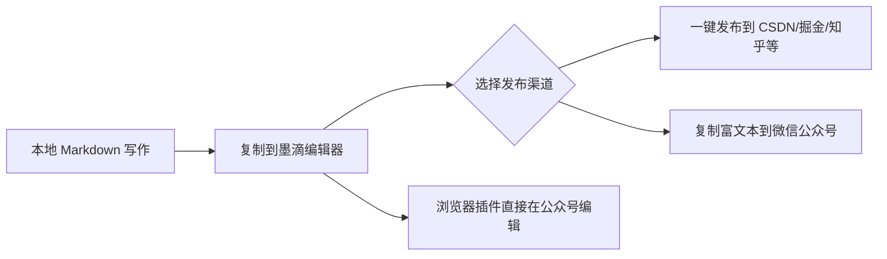
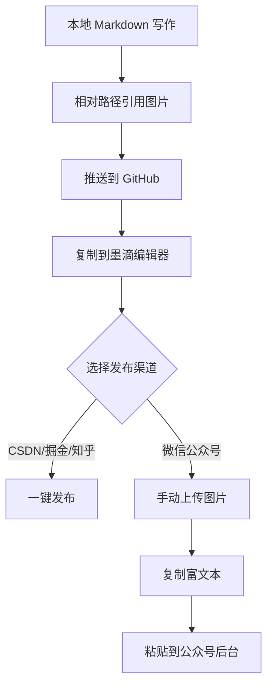

> 作为程序员，我们早已习惯了用 Markdown 写文档、写博客、写技术笔记。GitHub README、技术博客、掘金专栏...Markdown 几乎成了技术写作的标配。但你是否也遇到过这样的烦恼：写好一篇技术文章后，想要发布到多个平台，却需要一遍遍地复制粘贴、调整格式？尤其是微信公众号，Markdown都不支持。
本文将带你解决这个问题，实现**「一份 Markdown 文件，一键发布到 CSDN、掘金、简书、知乎、微信公众号」**的高效写作流程。
---
## 📋 目录
- [痛点分析](#痛点分析)
- [解决方案总览](#解决方案总览)
- [方案一：多平台一键发布](#方案一多平台一键发布)
- [方案二：微信公众号 Markdown 支持](#方案二微信公众号-markdown-支持)
- [图片处理的最佳实践](#图片处理的最佳实践)
- [完整工作流程](#完整工作流程)
- [常见问题](#常见问题)
---
## 痛点分析
在介绍解决方案之前，让我们先看看技术写作中常见的几个痛点：
| 痛点 | 描述 | 影响范围 |
|:---:|------|:--------:|
| 📝 **格式不兼容** | 不同平台对 Markdown 的支持程度不同 | 所有平台 |
| 🔗 **链接失效** | 微信公众号不支持外链 | 微信公众号 |
| 🖼️ **图片显示异常** | 相对路径图片在平台无法显示 | 所有平台 |
| 💻 **代码格式混乱** | 代码高亮样式丢失或错乱 | 尤其是微信公众号 |
| ⏰ **重复劳动** | 每个平台都要重新排版 | 降低写作效率 |
---
## 解决方案总览
> 🎯 核心思路：**本地用 Markdown 写作 + 墨滴平台转换 + 一键发布**

---
## 方案一：多平台一键发布
### 🌐 墨滴平台介绍
[墨滴](https://www.mdnice.com/) 是专为技术写作者打造的 Markdown 编辑平台，它完美解决了"一份 Markdown，多平台发布"的需求。
**核心功能：**
| 功能 | 说明 |
|:---|:---|
| ✏️ **Markdown 编辑** | 实时预览，所见即所得 |
| 🎨 **主题样式** | 多种技术风格主题可选 |
| 🔗 **一键发布** | 支持 CSDN、掘金、简书、知乎 等平台 |
| 📱 **微信适配** | 生成微信公众号兼容的富文本 |
### 📝 使用步骤
#### 1. 访问墨滴官网
打开浏览器，访问 [https://www.mdnice.com/](https://www.mdnice.com/)
> 💡 **提示**：建议使用 Chrome 浏览器以获得最佳体验。
#### 2. 粘贴 Markdown 内容
将你本地编辑好的 Markdown 内容复制并粘贴到左侧编辑区：
```
# 你的文章标题
## 代码示例
```javascript
console.log("Hello, World!");
```
## 表格示例
| 平台 | 支持 Markdown | 发布方式 |
|:---:|:---:|:---:|
| CSDN | ✅ | 一键发布 |
| 掘金 | ✅ | 一键发布 |
| 微信公众号 | ❌ | 复制富文本 |
```
#### 3. 选择主题样式
在右侧预览区上方，点击「主题」按钮，选择适合你文章风格的样式：
| 主题风格 | 适用场景 |
|:---|:---|
| 简约绿 | 通用技术文章 |
| GitHub 风格 | 开源项目文档 |
| 科技蓝 | 前端技术分享 |
| 暗色主题 | 夜间阅读风格 |
#### 4. 一键发布到各大平台
点击编辑器上方的「发布」按钮，你会看到支持的平台列表：
```
┌─────────────────────────────────────────┐
│  发布到平台                              │
├─────────────────────────────────────────┤
│  ☑ CSDN      ☑ 掘金      ☑ 简书        │
│  ☑ 知乎      ☑ SegmentFault ☑ 其他...   │
└─────────────────────────────────────────┘
```
> ⚠️ **首次使用需要授权**：点击对应平台后，会跳转到授权页面，登录你的账号并授权即可。
#### 5. 发布成功
发布成功后，你可以：
- 直接跳转到对应平台查看文章
- 继续编辑并发布到其他平台
- 将链接分享到社交媒体
---
## 方案二：微信公众号 Markdown 支持
微信公众号官方编辑器不支持 Markdown，这曾是技术写作者的噩梦。但墨滴提供了完美的解决方案。
### 🧩 方法一：复制富文本
在墨滴编辑器中，排版完成后，直接点击「复制」按钮：
```
┌─────────────────────────────┐
│  [复制] [清空] [导出]      │
└─────────────────────────────┘
```
然后打开微信公众号后台，新建文章，按 `Ctrl + V` 粘贴即可。
---
### 🔌 方法二：安装浏览器插件（推荐）
如果你希望直接在微信公众号编辑器中使用 Markdown，墨滴推出了浏览器插件。
#### 插件特点
| 特性 | 说明 |
|:---|:---|
| 📦 **轻量级** | 不占用过多系统资源 |
| 🎯 **精准适配** | 专为微信公众号编辑器设计 |
| 📥 **导入 Markdown** | 支持 `.md` 文件直接导入 |
| 🔄 **实时预览** | 编辑即预览，所见即所得 |
#### 安装步骤
**1. 下载插件**
访问墨滴官网的插件页面，下载对应浏览器的插件：
| 浏览器 | 下载链接 |
|:---|:---|
| Chrome | [Chrome 应用商店](https://chrome.google.com/webstore/) |
| Edge | [Edge 加载项](https://microsoftedge.microsoft.com/addons/) |
| Firefox | [Firefox 附加组件](https://addons.mozilla.org/) |
**2. 安装插件**
下载后，按照浏览器提示完成安装。
**3. 启用插件**
- 安装成功后，浏览器右上角会显示 Markdown Nice 图标
- 访问 [https://mp.weixin.qq.com/](https://mp.weixin.qq.com/)
- 点击插件图标，选择「启用 Markdown 编辑器」
**4. 导入 Markdown 文件**
在公众号编辑器页面，你会看到一个新的导入按钮：
```
┌─────────────────────────────────────┐
│  [导入 Markdown] [从剪贴板导入]    │
└─────────────────────────────────────┘
```
点击后选择你的 `.md` 文件，内容会自动转换并加载到编辑器中。
---
### ⚠️ 微信公众号的限制与注意事项
微信公众号有一些特殊的限制，发布前请注意：
#### 1. 外部链接问题
**问题**：微信公众号出于安全考虑，不允许插入指向外部网站的链接。
**解决方法**：
```markdown
❌ 错误写法
请参考 [我的 GitHub 仓库](https://github.com/username/repo)
✅ 正确写法
请参考我的 GitHub 仓库：
https://github.com/username/repo
```
> 💡 **提示**：可以在文章末尾用纯文本形式列出所有参考链接，或者使用微信公众号的「公众号链接」功能互相跳转。
#### 2. 图片链接问题
**问题**：微信公众号不支持外链图片，包括：
- GitHub Raw 链接：`https://raw.githubusercontent.com/...`
- 其他图床链接：`https://img.example.com/...`
**解决方法**：
```
❌ 直接使用图片链接

✅ 手动上传图片
1. 将图片复制到剪贴板
2. 在公众号编辑器中按 Ctrl+V 粘贴
3. 或使用图片上传按钮选择本地文件
```
---
## 图片处理的最佳实践
图片处理是技术写作中最头疼的问题之一。让我们深入探讨如何优雅地解决。
### 📁 本地项目中的图片引用
在 Git 项目中，我们习惯使用相对路径引用图片：
```markdown
<!-- 项目结构 -->
my-project/
├── docs/
│   └── article.md
└── images/
    └── screenshot.jpg
<!-- article.md 中的引用 -->

```
这种方式在本地预览和 GitHub 上完美显示，但：
| 场景 | 相对路径是否可用 | 原因 |
|:---:|:---:|:---|
| 本地预览 | ✅ | 文件系统直接访问 |
| GitHub README | ✅ | GitHub 自动渲染相对路径 |
| 墨滴编辑器 | ❌ | 无法访问你的本地文件系统 |
| 微信公众号 | ❌ | 不支持相对路径和外部链接 |
### 🖼️ 解决方案对比
#### 方案 A：图床 + 绝对路径（适合 GitHub、博客）
```markdown

```
**优点**：
- GitHub、掘金、CSDN 等平台都能正常显示
- 一份 Markdown，全平台通用
**缺点**：
- 微信公众号依然无法显示（被防盗链拦截）
- 需要配置图床，增加运维成本
---
#### 方案 B：手动上传（适合微信公众号）
这是目前最稳妥的方式，但需要手动操作。
**在墨滴中的操作：**
```
1. 将图片文件保存到本地
2. 在墨滴编辑器中点击图片按钮 🖼️
3. 选择「上传图片」
4. 上传完成后，图片链接会自动替换
```
**在微信公众号中的操作：**
```
1. 将图片复制到剪贴板（使用截图工具或直接复制文件）
2. 在公众号编辑器中按 Ctrl + V
3. 或点击「从图片库选择」上传
```
> 💡 **技巧**：建议在写文章时，将所有需要的图片统一放在一个文件夹中，方便后续批量上传。
---
#### 方案 C：使用 Markdown Nice 的图片上传功能
墨滴内置了图片上传功能，可以自动处理图片：
```
┌─────────────────────────────────────┐
│  🖼️ 图片上传                         │
├─────────────────────────────────────┤
│  支持上传到：                        │
│  • 墨滴图床（免费）                  │
│  • 七牛云                           │
│  • 阿里云 OSS                       │
└─────────────────────────────────────┘
```
**步骤：**
1. 将 Markdown 中的图片保留为占位符
2. 选中占位符，点击「图片上传」
3. 上传完成后，墨滴会自动替换链接
---
### 📊 推荐的工作流程
结合以上分析，推荐以下工作流程：

---
## 完整工作流程
下面是一个从零开始的完整工作流程示例：
### 步骤 1：本地准备
创建项目结构：
```
my-tech-article/
├── README.md
├── images/
│   ├── screenshot-1.png
│   ├── screenshot-2.png
│   └── diagram.svg
└── article.md
```
在 `article.md` 中写作：
```markdown
# 使用 Vite + React 快速搭建项目
Vite 是新一代的前端构建工具...
## 项目初始化
执行以下命令创建项目：
```bash
npm create vite@latest my-app -- --template react
```
## 效果预览

## 原理说明

```
### 步骤 2：推送到 GitHub
```bash
git init
git add .
git commit -m "Add new article"
git push origin main
```
### 步骤 3：发布到技术社区
1. 打开 [墨滴](https://www.mdnice.com/)
2. 粘贴 `article.md` 内容
3. 选择合适的主题
4. 点击「发布」按钮
5. 勾选「CSDN」「掘金」「知乎」
6. 确认发布
### 步骤 4：发布到微信公众号
1. 在墨滴编辑器中，点击图片占位符
2. 选择「上传图片」，从 `images/` 文件夹上传
3. 重复以上步骤，上传所有图片
4. 点击「复制」按钮
5. 打开微信公众号后台，新建文章
6. 粘贴内容，检查格式
7. 发布
---
## 常见问题
### ❓ 1. 为什么我的代码块在微信公众号中换行错乱？
**原因**：代码块内容过长导致自动换行，破坏了格式。
**解决方法**：
- 在墨滴中启用「代码横向滚动」功能
- 将过长的代码拆分成多行
- 使用截图代替代码（不推荐）
---
### ❓ 2. 表格在微信公众号中显示错位怎么办？
**原因**：微信编辑器的表格宽度计算有问题。
**解决方法**：
- 使用墨滴的表格样式优化
- 避免使用过于复杂的嵌套表格
- 必要时使用截图展示表格
---
### ❓ 3. 能不能实现真正的「一键发布到微信公众号」？
**回答**：目前技术上无法实现。
**原因**：
- 微信公众号的图片必须上传到微信服务器
- 外部链接会被拦截
- 需要人工审核（部分情况）
**建议**：将微信公众号视为"特殊平台"，接受需要手动调整图片和链接的事实。
---
### ❓ 4. 墨滴支持哪些代码语言的高亮？
**回答**：支持几乎所有主流编程语言，包括但不限于：
| 类别 | 支持语言 |
|:---|:---|
| 前端 | JavaScript, TypeScript, HTML, CSS, Vue, React |
| 后端 | Python, Java, Go, Rust, PHP, Node.js |
| 移动端 | Swift, Kotlin, Flutter, React Native |
| 其他 | SQL, Shell, Markdown, JSON, YAML |
---
### ❓ 5. 我的内容发布到多个平台算不算抄袭？
**回答**：这取决于平台的规则。
**建议**：
- 声明原创时，选择最早发布的平台
- 在其他平台发布时，标注"原文首发于 xxx"
- 部分平台（如掘金）允许标注"已同步至其他平台"
---
## 总结
通过本文介绍的方案，你可以实现高效的技术写作工作流：
```
┌─────────────────────────────────────────────────────────┐
│                    技术写作工作流                        │
├─────────────────────────────────────────────────────────┤
│                                                         │
│  1️⃣ 本地用 Markdown 写作 + 相对路径引用图片              │
│                     ↓                                   │
│  2️⃣ 推送到 GitHub（版本控制 + 备份）                    │
│                     ↓                                   │
│  3️⃣ 复制到墨滴编辑器 + 选择主题                         │
│                     ↓                                   │
│  4️⃣ 一键发布到 CSDN / 掘金 / 知乎等                     │
│                     ↓                                   │
│  5️⃣ 手动上传图片 + 复制富文本到微信公众号               │
│                     ↓                                   │
│  ✅ 全平台覆盖，一次写作，多处发布                       │
│                                                         │
└─────────────────────────────────────────────────────────┘
```
**核心要点回顾：**
| 要点 | 说明 |
|:---|:---|
| 📝 **写作工具** | 坚持 Markdown，用你最熟悉的编辑器 |
| 🎨 **样式控制** | 利用墨滴的主题系统，保持风格统一 |
| 🔗 **链接处理** | 微信公众号必须去除外链，使用纯文本 |
| 🖼️ **图片处理** | 接受手动上传的现实，批量处理提高效率 |
| 🚀 **发布效率** | 技术社区一键发布，微信手动调整 |
> 💡 **最后的小建议**：写作的目的是分享知识，不要让繁琐的格式调整消耗你的热情。选择合适的工具，建立稳定的工作流，把更多时间投入到内容创作上。
---
**相关资源：**
- [墨滴官网](https://www.mdnice.com/)
- [Markdown Nice 浏览器插件](https://www.mdnice.com/)
- [Markdown 语法教程](https://www.markdownguide.org/)
**如果本文对你有帮助，欢迎点赞、收藏、转发！** 🙏
